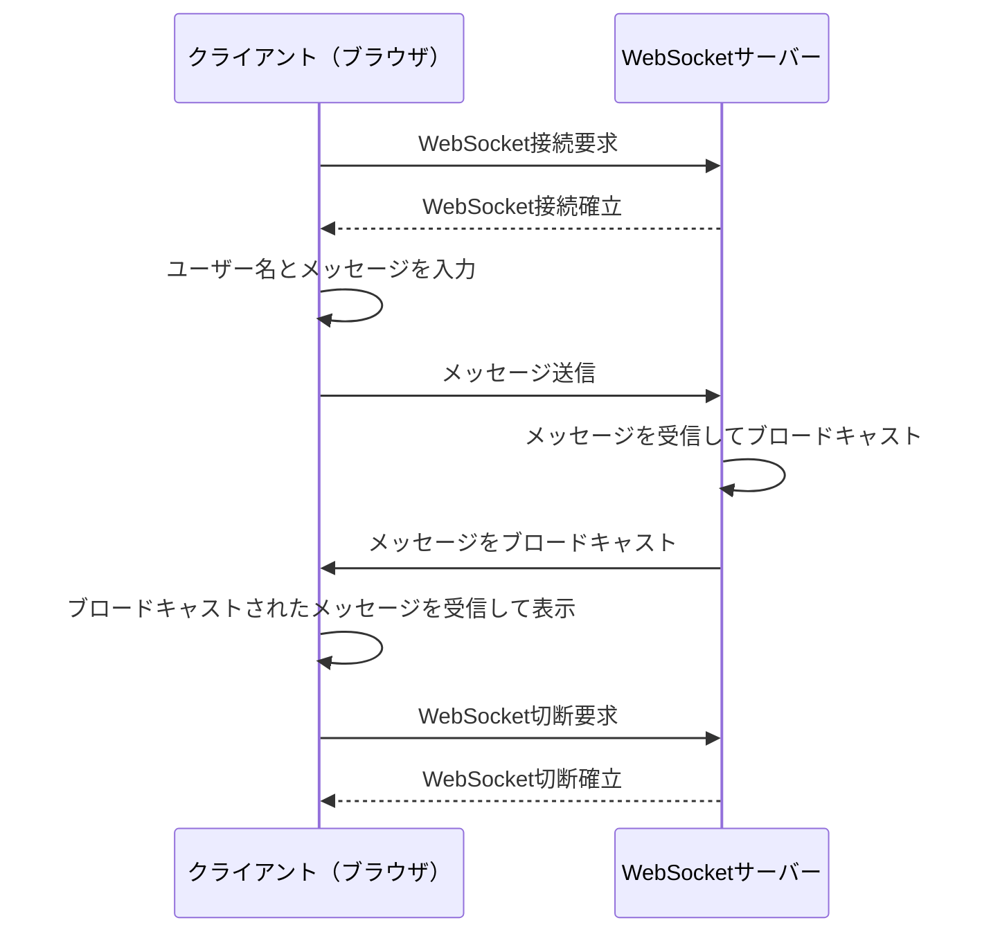
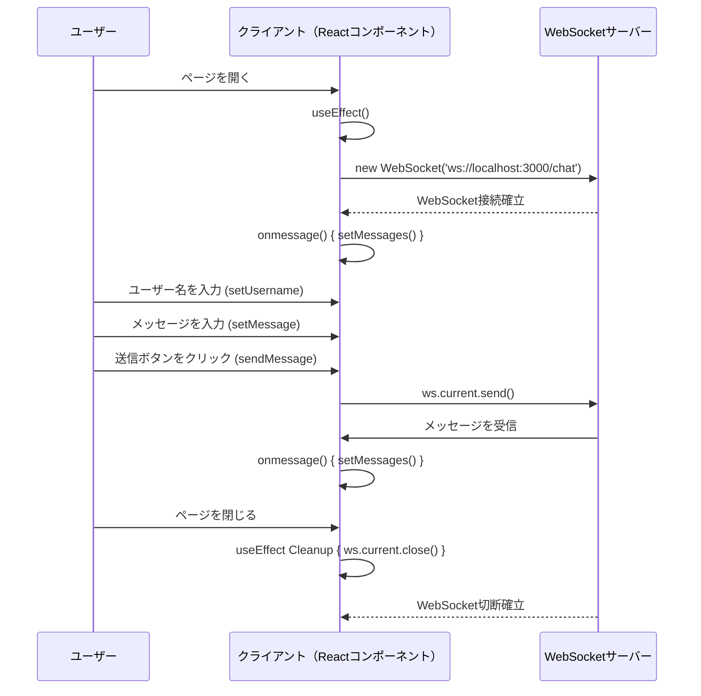
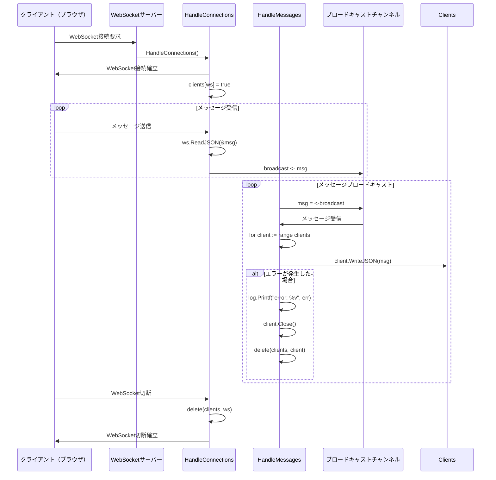

# プロダクト名：SAMPLE

## **概要**

SAMPLE

---

## **前提条件**

お使いの環境が利用可能でない場合は[こちら](https://code.visualstudio.com/docs/remote/containers)を参考に事前作業を行ってください。

1. VSCode Remote Containers が利用可能である事

---

## **環境構築手順**

以下の手順に従って下さい。

1. 本リポジトリを git clone します

   ```bash
   $ git clone git@github.com:s-duu-jp/sample.git
   ```

1. クローン後、以下コマンドでコンテナを起動します。

   ```bash
   $ arg="sample" \
     && cd ${arg} \
     && code --folder-uri vscode-remote://dev-container+$(echo -n $(pwd) | xxd -p)/workspace
   ```

---

## **サービス起動手順**

| システム       | 起動コマンド      | アクセス URL          |
| -------------- | ----------------- | --------------------- |
| すべて起動     | **$ npm start**   | -                     |
| バックエンド   | **$ npm run api** | http://localhost:3333 |
| フロントエンド | **$ npm run web** | http://localhost:4200 |

---

## **作業の進め方**

本プロジェクトでは与えられたタスクもしくは作業が必要なタスク毎にブランチを作成します。

### **作業の開始**

1. 既に起票中のタスクを割り当てられた場合

   1-1. ブランチを作成する前にチケット ID(XX-X)を確認するため[プロジェクトボード](https://id.atlassian.com/)へ移動します。

   1-2. 割り当てられたタスクのチケット ID (例:DC-1)を確認します。

   1-3. ブランチを作成します。

   ```bash
   $ git checkout -b ${チケットID}
   ```

   `(例：$ git checkout -b DC-1)`

   1-4. 作成したブランチをリポジトリへ反映します。

   ```bash
   $ git push --set-upstream origin ${チケットID}
   ```

   `(例：$ git push --set-upstream origin DC-1)`

1. 新たにチケット ID を発行して作業を行う場合

   2-1. [プロジェクトボード](https://id.atlassian.com/)へ移動します。

   2-2. 適所にタスクを起票してチケット ID (例:DC-1)を発行します。

   2-3. ブランチを作成します。

   ```bash
   $ git checkout -b ${チケットID}
   ```

   `(例：$ git checkout -b DC-1)`

   2-4. 作成したブランチをリポジトリへ反映します。

   ```bash
   $ git push --set-upstream origin ${チケットID}
   ```

   `(例：$ git push --set-upstream origin DC-1)`

### **Pull Request を出す**

1. Github の[プロジェクト](https://id.atlassian.com/)へアクセスして任意のブランチから`Pull request`をクリックします。

1. 修正内容を記入します。

1. 最後に`Create pull request`をクリックします。

---

## **開発するにあたって**

### コーディング規約

- `any`は極力利用しないで下さい！

  TypeScript なので`any`は極力使用せず型を指定するようにしてください。
  型を利用することでプロパティへ安全にアクセスできる、インテリセンスが利く、どんなデータを扱いたいのかわかりやすく可読性が上がる等のメリットがあります。
  any を使う理由がある場合は以下のようにコメントで理由を記載して該当箇所だけ Lint を無効にしてください。

  ```ts
  // anyを使う理由
  // eslint-disable-next-line @typescript-eslint/no-explicit-any
  ```


# 全体


# フロント



# バックエンド


